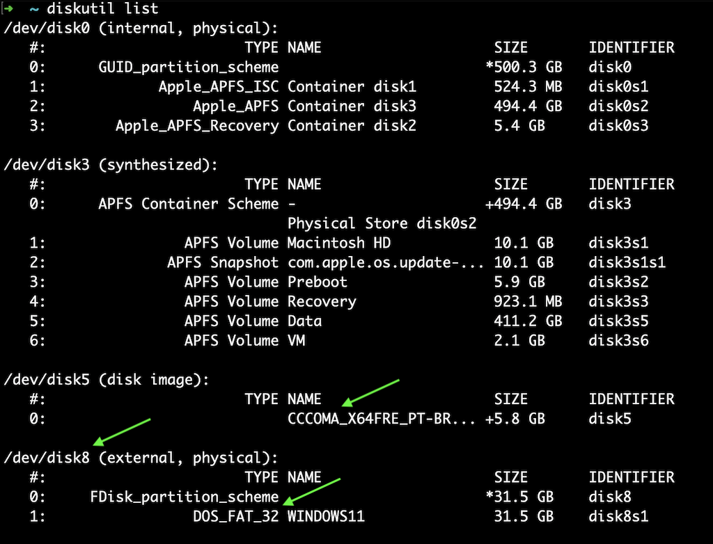
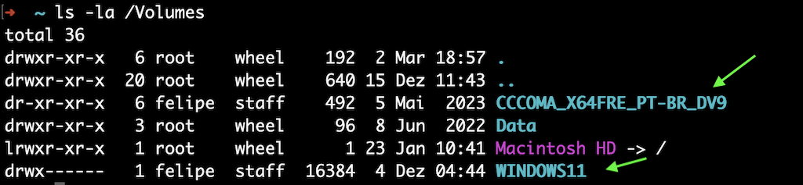

# Bootable USB Helpers

This would be a repository with some tips to help create bootable USB devices.

## Windows 10/11 on MacOS

How to create a Windows 10 (or Windows 11) bootable USB on MacOS?

### The problem

You've probably already noticed that it's impossible to just copy the files from the Windows ISO to a USB drive, as we have to use a FAT32 file system, which doesn't allow files larger than 4GB. But in the uncompressed ISO file we have an `install.win` file with more than that.

### The solution

So the solution is to split this file into smaller pieces. To do this, we'll use the MacOS `Terminal` and make some commands. Let's go.

### The script

I created an automated script that performs all these steps. Then you just need to run it and follow the commands:

```shell
/bin/bash -c "$(curl -fsSL https://raw.githubusercontent.com/frizeiro/bootable-usb/main/scripts/windows.sh)"
```

Or you can do it step by step.

### The Steps

#### Step 1: Downloading the ISO file

Use the official links to download the desired ISO file:

- Windows 10: https://www.microsoft.com/software-download/windows10ISO
- Windows 11: https://www.microsoft.com/software-download/windows11

#### Step 2: Identifying the destination USB disk
```shell
diskutil list
```

Use the command above to have a list of your disks and identify the USB one.



In our example, `disk8` is the name of the USB driver entered and we will have to save this information.

Also, you can list only your external physical devices:
```shell
diskutil list external physical
```

#### Step 3: Formatting the USB drive

```shell
diskutil eraseDisk MS-DOS "WINDOWS11" MBR disk@
```

Using the above command we will completely erase and format the drive, so make sure you choose the right one.

<strong>Note:</strong> I keep this command with `disk@` to avoid mistakes. For our example, I should use `disk8`, but you should use the disk name that corresponds to your USB drive.

#### Step 4: Mounting the ISO file

```shell
hdiutil mount ~/Downloads/Win11_22H2_BrazilianPortuguese_x64v1.iso
```

You should change the folder to the location where Windows ISO file is.

#### Step 5: Identifying the needed mounted volumes

```shell
ls -la /Volumes
```

The above command will help us identify the mounted Windows ISO and formatted USB volumes.



#### Step 6: Copying the files

Now we will copy all files to USB except `install.wim` as we need to split it.

```shell
rsync -avh --progress --exclude=sources/install.wim /Volumes/CCCOMA_X64FRE_PT-BR_DV9/ /Volumes/WINDOWS11
```

<strong>Note:</strong> Keep the forward slash ("/") after the ISO volume path. Otherwise you will copy the directory and not its contents.

#### Step 7: Installing `wimlib`

This is where we make all things happen. But for this we will need a specific command installed on your Mac: `wimlib`.

If you have already installed it. Everything is ready. Otherwise, you will need to install through `Homebrew`.

```shell
brew install wimlib
```

If you don't have `Homebrew` installed too. You can install it before:

```shell
/bin/bash -c "$(curl -fsSL https://raw.githubusercontent.com/Homebrew/install/master/install.sh)"
```

And than try to install `wimlib` again.

#### Step 8: Splitting the `install.win` file

Now let's split the `install.win` file already copying the result files to USB, setting the max file size to 3800 MB.

```shell
wimlib-imagex split /Volumes/CCCOMA_X64FRE_PT-BR_DV9/sources/install.wim /Volumes/WINDOWS11/sources/install.swm 3800
```

That's it! The `install.win` file has been split successfully and your bootable USB drive is ready to use.